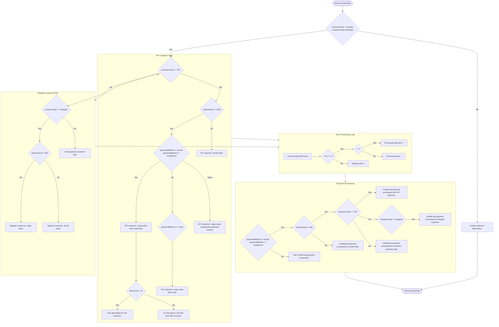

```mermaid
flowchart TD
    Start(["Start processOrder"]) --> CheckCustomerType{"customerType != null && !customerType.isEmpty()"}
    CheckCustomerType -->|No| InvalidCustomerInfo["Invalid customer information."]
    CheckCustomerType -->|Yes| DetermineCustomerType{"customerType == 'VIP'"}

    subgraph VIP_Flow ["VIP Customer Flow"]
        DetermineCustomerType -->|Yes| CheckLargeOrder{"orderAmount > 1000"}
        CheckLargeOrder -->|Yes| VIPPaymentMethod{"paymentMethod != null && paymentMethod == 'CreditCard'"}
        VIPPaymentMethod -->|Yes| VIPLargeCreditCard["VIP customer: Large order with CreditCard."]
        VIPLargeCreditCard --> CheckVIPItemsCount{"itemCount > 10"}
        CheckVIPItemsCount -->|Yes| VIPFreeGift["Free gift added for VIP customer."]
        CheckVIPItemsCount -->|No| NoVIPFreeGift["No free gift for VIP with less than 10 items."]
        VIPPaymentMethod -->|No| VIPCash{"paymentMethod == 'Cash'"}
        VIPCash --> VIPLargeCash["VIP customer: Large order with Cash."]
        VIPPaymentMethod -->|Other| VIPUnsupported["VIP customer: Large order, unsupported payment method."]
        CheckLargeOrder -->|No| VIPSmallOrder["VIP customer: Small order."]
    end

    subgraph Regular_Flow ["Regular Customer Flow"]
        DetermineCustomerType -->|No| RegularCheck{"customerType == 'Regular'"}
        RegularCheck -->|Yes| CheckRegularLargeOrder{"orderAmount > 500"}
        CheckRegularLargeOrder -->|Yes| RegularLargeOrder["Regular customer: Large order."]
        CheckRegularLargeOrder -->|No| RegularSmallOrder["Regular customer: Small order."]
        RegularCheck -->|No| UnrecognizedCustomer["Unrecognized customer type."]
    end

    subgraph ItemProcessing_Flow ["Item Processing Loop"]
        ProcessItems["Loop through itemCount"]
        ProcessItems --> EvenItem{"i % 2 == 0"}
        EvenItem -->|Yes| BulkItemCheck{"i > 5"}
        BulkItemCheck -->|Yes| BulkItem["Processing bulk item: i"]
        BulkItemCheck -->|No| NormalItem["Processing item: i"]
        EvenItem -->|No| SkippedItem["Skipping item: i"]
    end

    subgraph PaymentProcessing_Flow ["Payment Processing"]
        DeterminePaymentMethod{"paymentMethod != null && paymentMethod == 'CreditCard'"}
        DeterminePaymentMethod -->|Yes| CreditCardCheck{"orderAmount > 200"}
        CreditCardCheck -->|Yes| CreditCardCustomerType{"customerType == 'VIP'"}
        CreditCardCustomerType -->|Yes| VIPDiscount["CreditCard payment processed with VIP discount."]
        CreditCardCustomerType -->|No| CreditCardRegular{"customerType == 'Regular'"}
        CreditCardRegular -->|Yes| RegularCC["CreditCard payment processed for Regular customer."]
        CreditCardCustomerType -->|No| UnknownCC["CreditCard payment processed for unknown customer type."]
        CreditCardCheck -->|No| SmallOrderCC["CreditCard payment processed for small order."]
        DeterminePaymentMethod -->|No| NonCreditCardPayment["Non-CreditCard payment processed."]
    end

    DetermineCustomerType --> VIP_Flow
    DetermineCustomerType --> Regular_Flow
    VIP_Flow --> ItemProcessing_Flow
    Regular_Flow --> ItemProcessing_Flow
    ItemProcessing_Flow --> PaymentProcessing_Flow
    InvalidCustomerInfo --> End(["End processOrder"])
    PaymentProcessing_Flow --> End
```